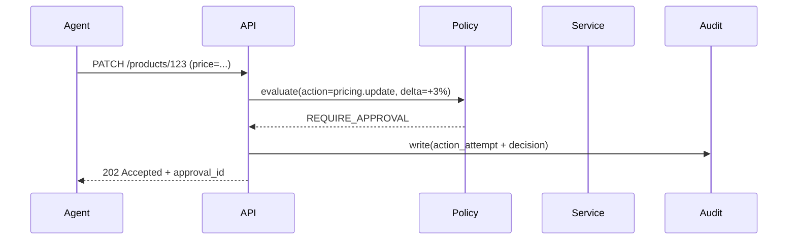
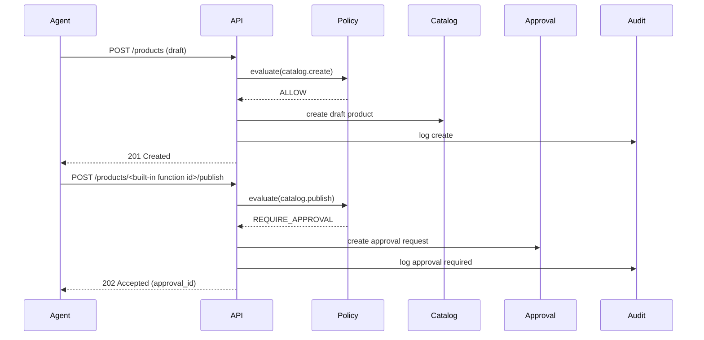
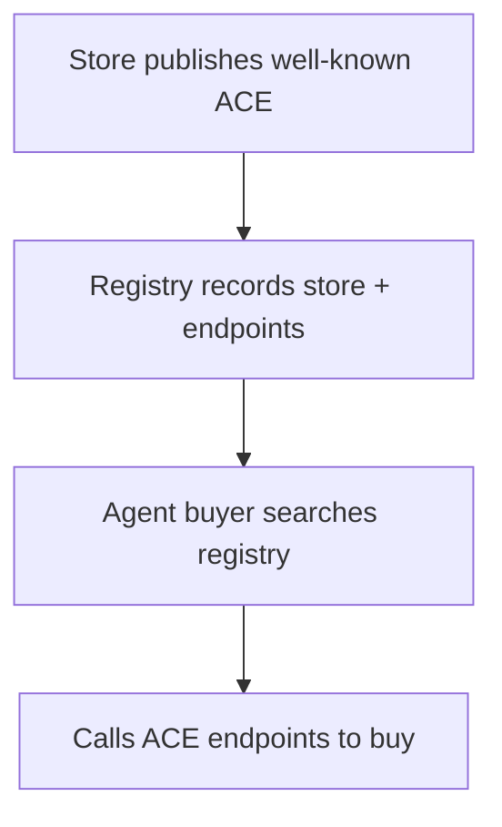

# Tienda Agent‑Native (TAN) — Especificación Técnica (CloudCode‑Ready)

**Fecha:** 2026-02-22  
**Objetivo:** especificación completa para implementar por fases, con arquitectura y APIs.

---

## 0) Alcance y supuestos

### Alcance
- Plataforma multi‑tenant para crear/operar tiendas.
- Storefront web (humano) + ACE (Agent Commerce Endpoint) (máquina).
- Capa agent‑native: permisos, límites, approvals, auditoría y observabilidad.
- Roadmap por MVPs: Catálogo/Stock → Órdenes → Optimización → Discovery (Registry).

### Fuera de alcance inicial (pero considerado)
- Marketplace de agentes/módulos (puede venir después).
- Motor de ads completo; se integrará por conectores.
- Pagos propios (se integra con PSP / wallet).

### Supuestos de stack (editables)
- CloudCode como capa de backend/logic.
- Auth: OIDC/JWT, OAuth2 para conectores.
- Persistencia: Postgres (core), Redis (colas/caché), Object Storage (imágenes, logs).
- Eventing: cola (SQS/PubSub/Kafka según infra) para workflows.

---

## 1) Conceptos clave

### 1.1 Entidades principales
- **Tenant**: cuenta (merchant/empresa).
- **Store**: tienda dentro de un tenant.
- **AgentPrincipal**: identidad de agente (client credentials).
- **HumanUser**: usuario humano.
- **Product / Variant**
- **InventoryItem**
- **Order / Fulfillment / Return**
- **Policy**: reglas y permisos.
- **ApprovalRequest**: solicitud para ejecutar una acción sensible.
- **AuditLog**: log inmutable de acciones.
- **Connector**: integración externa (envíos, pagos, CRM, etc.)
- **Budget**: límites de gasto y rate limits por agente/tenant/store.

### 1.2 Clases de acción (para policies)
- **Read**: leer catálogo, órdenes, métricas
- **Write‑Low**: editar descripción, tags, imágenes, stock dentro de rango
- **Write‑High**: publicar producto, cambios grandes de precio, reembolsos
- **Money‑Move**: capturar pagos, reembolsar, comprar ads

---

## 2) Arquitectura (alto nivel)

```mermaid
flowchart LR
  subgraph Users
    H[Humano: merchant/ops]
    A[Agente autónomo]
    B[Agente comprador externo]
  end

  subgraph TAN[Plataforma Tienda Agent‑Native]
    W[Web Storefront + Admin UI]
    API[Core API Gateway]
    ACE[Agent Commerce Endpoint]
    POL[Policy Engine + Approvals]
    ORCH[Orchestrator / Workflows]
    AUD[Audit Log Service]
    OBS[Observability (metrics/traces)]
    CAT[Catalog Service]
    ORD[Order Service]
    INV[Inventory Service]
    PAY[Payments Adapter]
    SHIP[Shipping Adapter]
    REG[Registry (fase 2)]
  end

  subgraph External
    PSP[PSP / Wallet]
    CARR[Carriers/Logística]
    IDX[Indexers / Search]
  end

  H --> W --> API
  A --> API
  B --> ACE --> API

  API --> CAT
  API --> INV
  API --> ORD
  API --> POL
  API --> AUD
  API --> ORCH
  ORCH --> PAY --> PSP
  ORCH --> SHIP --> CARR
  OBS --- API
  OBS --- ORCH

  REG --> IDX
  ACE --> REG
```

### 2.1 Principio operativo
1) Toda acción mutante pasa por **Policy Engine**.
2) Si requiere aprobación, se crea **ApprovalRequest** y se detiene la ejecución.
3) Cuando se aprueba, el Orchestrator continúa.
4) Todo queda registrado en **AuditLog** y métricas en **OBS**.

---

## 3) Agent Commerce Endpoint (ACE)

### 3.1 Descubrimiento (well‑known)
- URL: `https://<store-domain>/.well-known/agent-commerce`
- Método: `GET`
- Respuesta: JSON con capacidades, endpoints y políticas públicas.

Ejemplo mínimo:

```json
{
  "store_id": "st_123",
  "version": "1.0",
  "ace_base_url": "https://<store-domain>/ace/v1",
  "catalog_endpoint": "/products",
  "quote_endpoint": "/shipping/quote",
  "cart_endpoint": "/cart",
  "order_endpoint": "/orders",
  "auth": {
    "type": "oauth2_client_credentials",
    "token_url": "https://<store-domain>/oauth/token",
    "scopes": ["catalog.read", "order.create"]
  },
  "policies_public": {
    "max_qty_per_order": 5,
    "supported_currencies": ["ARS", "USD"]
  }
}
```

### 3.2 Estándar ACE v1 (recursos)
- `GET /ace/v1/products` (paginado, filtros)
- `GET /ace/v1/products/<built-in function id>`
- `POST /ace/v1/shipping/quote`
- `POST /ace/v1/cart` (crear carrito)
- `POST /ace/v1/cart/<built-in function id>/items` (agregar items)
- `POST /ace/v1/orders` (crear orden)
- `GET /ace/v1/orders/<built-in function id>`
- `POST /ace/v1/orders/<built-in function id>/pay` (pago directo o iniciar approval)
- `GET /ace/v1/approvals/<built-in function id>`

> Nota: para MVP, puede bastar con productos + crear orden + approval.

---

## 4) Seguridad, identidad y permisos

### 4.1 Identidad
- Humanos: OIDC (login) → JWT.
- Agentes: OAuth2 Client Credentials (client_id/client_secret) + scopes.
- Agentes externos: se tratan como “apps” con scopes limitados.

### 4.2 Scopes sugeridos
- `catalog.read`, `catalog.write`
- `inventory.read`, `inventory.write`
- `orders.read`, `orders.write`
- `orders.refund` (alto riesgo)
- `pricing.write_limited` (con límites)
- `admin.policy.manage`

### 4.3 Policy Engine (modelo)
Reglas por:
- acción (tipo)
- recursos (producto, categoría, store)
- rango permitido (ej: precio ±5%)
- condiciones (ej: sólo si stock>0)
- rol del principal (agente/humano)
- presupuesto/cupo

**Evaluación**:
- `ALLOW`
- `DENY`
- `REQUIRE_APPROVAL` (con template de aprobación)

---

## 5) Auditoría y observabilidad

### 5.1 Auditoría (inmutable)
Cada acción mutante genera un `AuditLog` con:
- actor (agente/humano)
- intención (por qué)
- diff (antes/después)
- request_id, correlation_id
- policy_decision
- timestamps
- firma (opcional) / hash encadenado



### 5.2 Observabilidad (MVP)
- métricas por store/agent: tareas, éxito/error, latencia
- costo estimado por tarea (si aplica)
- alertas: loops, spikes de costo, spikes de fallas

---

## 6) Modelo de datos (esqueleto)

> Nombres ilustrativos. Ajustar a ORM/DB.

- `tenants(id, name, plan, status)`
- `stores(id, tenant_id, domain, currency, timezone, status)`
- `agents(id, tenant_id, name, client_id, hashed_secret, status)`
- `policies(id, tenant_id, store_id, json_rules, version, status)`
- `products(id, store_id, title, description, status, ...)`
- `variants(id, product_id, sku, price, currency, attributes_json, ...)`
- `inventory(id, variant_id, on_hand, reserved, updated_at)`
- `orders(id, store_id, buyer_json, status, totals_json, ...)`
- `order_items(id, order_id, variant_id, qty, unit_price, ...)`
- `approvals(id, store_id, requested_by, action, payload_json, status, ...)`
- `audit_logs(id, store_id, actor, action, before_json, after_json, decision, ...)`
- `budgets(id, scope, limit_json, usage_json, period, ...)`

---

## 7) Desarrollo por fases (MVPs)

### Fase 0 — Fundaciones (2–4 semanas)
- Multi‑tenant + auth humano/agente
- Core services: catalog, inventory, orders (skeleton)
- Policy Engine v0 (ALLOW/DENY/APPROVAL)
- AuditLog v0
- ACE well‑known + `GET /products`

**Exit criteria:**
- un agente autenticado puede leer catálogo y proponer cambios (sin ejecutar)

---

### MVP 1 — Catálogo + Stock (4–8 semanas)
**Objetivo:** que agentes puedan operar el “backoffice” con bajo riesgo.

Features:
- CRUD de productos/variantes (con policies)
- subida de imágenes (presigned URLs)
- edición masiva (bulk) con validaciones
- inventario: actualizar stock con límites/reglas
- publicación/despublicación con approval

Diagrama (flujo publicación):



**Exit criteria:**
- agente puede cargar 100 productos y mantener stock con errores <X%
- acciones riesgosas requieren aprobación

---

### MVP 2 — Órdenes + Comunicación (6–10 semanas)
Features:
- creación/gestión de órdenes
- estados de fulfillment
- integración shipping adapter (mínima)
- atención al cliente: plantillas + respuestas sugeridas
- devoluciones con límites (approval por defecto)

**Exit criteria:**
- agente puede procesar órdenes end‑to‑end en sandbox + en prod con approvals

---

### MVP 3 — Optimización controlada (6–12 semanas)
Features:
- repricing con bandas (±X%)
- promos sugeridas con approval
- alertas por stock y recomendaciones de reposición
- integración ads adapter (solo “proponer” en v1)

**Exit criteria:**
- mejoras medibles en conversión/margen sin aumentar incidentes

---

### MVP 4 — Discovery (Registry) (4–8 semanas)
Features:
- registro de tienda (verificación)
- health checks del ACE endpoint
- búsqueda por categoría/país/moneda
- reputación/señales básicas



---

## 8) Conectores (Adapters)

Diseño: interfaz estable + implementaciones por proveedor.

- `PaymentsAdapter`: authorize/capture/refund
- `ShippingAdapter`: quote/create_label/track
- `MessagingAdapter`: email/whatsapp/chat (si aplica)
- `ERPAdapter`: sync stock/prices (opcional)

Cada adapter:
- credenciales en vault/secret manager
- scopes y policies por conector
- retries + idempotency keys

---

## 9) Idempotencia y consistencia

- Todas las operaciones mutantes aceptan `Idempotency-Key`.
- Órdenes y pagos: transacciones con estados (pending → authorized → captured).
- Eventos async para fulfillment y tracking.

---

## 10) Plan de testing (mínimo viable)

- Unit: policy evaluation, validation.
- Contract tests: ACE endpoints.
- E2E sandbox: “create product → publish approval → order → pay approval → fulfill”.
- Chaos: fallas de conector (shipping/payments) con retries y circuit breaker.

---

## 11) Checklist de entrega por fase

- endpoints documentados (OpenAPI)
- dashboards de métricas
- auditoría consultable
- runbooks de incidentes (loops, gasto, fraude)
