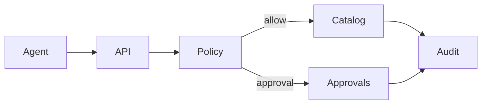

# TAN — Plan de desarrollo por fases (detallado)

**Fecha:** 2026-02-22

---

## Visión
Una plataforma donde agentes crean y operan tiendas con seguridad, y otros agentes pueden encontrarlas y comprar.

---

## Fase 0: Fundaciones (Sprint 1–2)

### Entregables
- Multi‑tenant + stores
- Auth humano/agente (client credentials)
- Policy Engine v0 (ALLOW/DENY/APPROVAL)
- AuditLog v0
- ACE discovery + catálogo read‑only

### Riesgos a atacar
- modelado de permisos
- trazabilidad
- idempotencia base

---

## MVP 1: Catálogo + Stock (Sprint 3–6)

### Features
- Productos/variantes
- Bulk operations
- Imágenes
- Inventario
- Publicación con approvals

### Arquitectura específica

### Calidad
- validación de atributos
- pruebas e2e de bulk
- rate limits de escritura

---

## MVP 2: Órdenes + Post‑venta (Sprint 7–12)

### Features
- órdenes, estados, fulfillment
- shipping adapter mínimo (quote + label)
- devoluciones con approval
- comunicaciones (plantillas)

### Calidad
- idempotencia fuerte en pagos/fulfillment
- circuit breaker en conectores

---

## MVP 3: Optimización (Sprint 13–18)

### Features
- repricing con bandas
- promos sugeridas
- alertas stock / recomendaciones
- ads “proponer” + approval

### Calidad
- simulación / impacto estimado
- rollback seguro

---

## MVP 4: Discovery (Registry) (Sprint 19–22)

### Features
- registry de tiendas
- verificación
- health checks ACE
- búsqueda + filtros
- señales de reputación básicas

---

## MVP 5 (opcional): Ecosistema
- feeds abiertos
- indexadores externos
- ranking
- marketplace de conectores/módulos

---

## Dependencias y decisiones abiertas
- ¿dominio propio por store o subdominio?
- ¿PSP/wallet elegido?
- ¿logística propia vs integradores?
- ¿nivel enterprise de auditoría (WORM, hash chain)?
